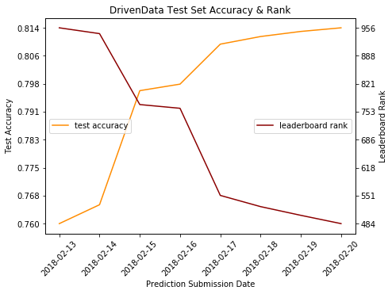
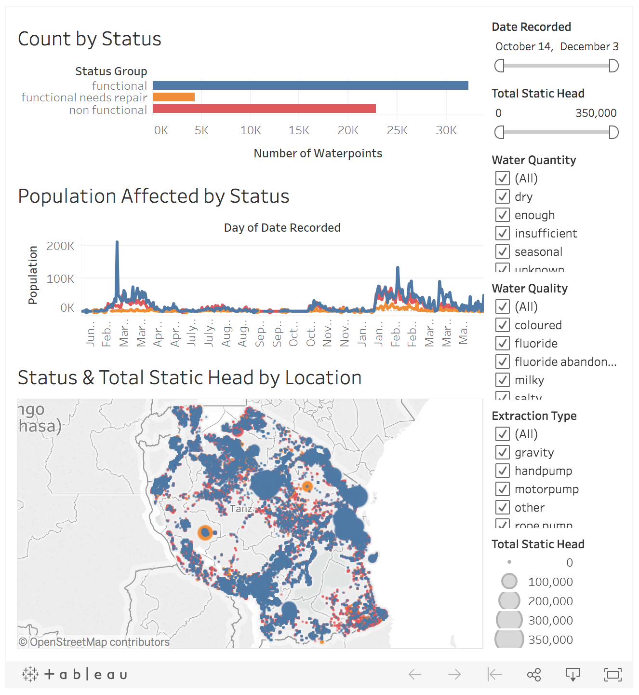

# Predicting the Functionality of Tanzania Waterpoints

## Objective
The goal of this project was to predict the operating condition of waterpoints in Tanzania, as part of the [DrivenData competition](https://www.drivendata.org/competitions/7/pump-it-up-data-mining-the-water-table/) "Pump it Up: Data Mining the Water Table". The data is provided by [Taarifa](http://taarifa.org/) and the Tanzanian Ministry of Water and presents a three-class operational status of **functional**, **functional needs repair**, and **non functional** for each of 59,400 waterpoints across the country. Classifying statuses accurately would help improve operations and maintenance planning of these units, allocate resources more quickly to needed areas, and ensure potable water is accessible to as many people as possible.

## Tools
- Numpy and Pandas for data manipulation
- Scikit-learn for modeling
- Matplotlib and Seaborn for plotting
- Tableau for interactive visualizations

## Exploratory Data Analysis
The dataset contains 40 features per waterpoint, 32 which are categorical. Nearly a third of the individual features could be grouped into more general categories, and an in-depth analysis of 20 of them was undertaken to inform baseline models and feature engineering. Having found significant class imbalance for status, it was critical to identify aspects of each sample that could offer strong signal.

In addition to intuitive findings from this exercise were anomalous combinations of certain features with respect to the target label, status group. For example, many functional waterpoints had zero values for total static head (a continuous measurement of available water), while non functional units had TSH well above zero. Similarly the qualitative variable called quantity exhibited inconsistency when compared to waterpoint status, with needs repair and non functional units displaying 'enough' water quantity.

Overall, the majority of the 20 inspected features appeared useful for distinguishing between the three statuses.

## Baseline Models
Logistic regression, k-nearest neighbors, and random forest classifiers were used as baseline models with only one and then four numeric features. The reason for applying three different algorithms in baselining was to understand which may be most appropriate for the given problem, independent of any model tuning or feature engineering. This also quantified the increase in accuracy gained from simply changing algorithms, compared to future work on optimizing the model. A big benefit of random forest was feature importance ranking which directly affected the choice and order of variables to be included later on.

## Feature Engineering
1. Mapping latitude and longitude to 3-dimensional coordinates so nearby continuous values would also be close in reality
2. Converting categorical features to binary dummy variables
3. Combining particular dummies and ranges of numeric features to highlight strong signals and illogical values for waterpoint status identified during EDA
4. Selecting subsets of the total unique values for categorical features that were converted to dummies, according to the number of samples they were associated with and their contribution to certain statuses
5. Applying optimal class weights found through grid search

## Model Evaluation
The entire training dataset of 59,400 records was split into 80/20 train vs. holdout, and all scores reported below were calculated with 5-fold cross validation on the training portion only. DrivenData provides a competition 'test' set of 14,850 unlabeled samples which were used for multiple submissions throughout model selection process. Predictions on the 20% holdout were limited to the very end, so this split was only used and scores seen just once.

The official metric for DrivenData was classification rate (accuracy); however as noted above, class weights were included to improve performance against F1 score and provide a more useful real-world application where classification of the minority class (functional needs repair) would be essential. While ongoing development of this project will focus on F1, it is unfortunate that this alternative scoring for a true holdout set is not possible.

**Baseline**  
*5-fold CV accuracy*
- Logistic regression
  - one numeric feature: 0.542
  - four numeric: 0.539
- K-nearest neighbors
  - four numeric: 0.610
- Random forest
  - four numeric: 0.642

**Model Selection**  
*5-fold CV accuracy with random forest*
1. 4,112 features (4,108 dummies from 12 categorical): 0.697
2. top 20 features from importance ranking: 0.736
3. added x, y, z coordinates: 0.756
4. added class weights for target imbalance: 0.762
5. final model, 99 features (7 numeric)
   - accuracy 0.797
   - F1 0.791 weighted 0.679 macro
   - precision 0.792 weighted 0.722 macro
   - recall 0.797 weighted 0.658 macro

**Holdout**  
Accuracy: 0.802  
F1: 0.795 weighted, 0.685 macro  
Precision: 0.796 weighted, 0.725 macro  
Recall: 0.802 weighted, 0.664 macro

## Competition Results

## Interactive Visualizations
[Tanzania Waterpoints](https://public.tableau.com/profile/arjun#!/vizhome/TanzaniaWater/TanzaniaWaterpoints) will be embedded on my personal website and blog, [arjun.net](http://arjun.net)

## Next Steps
While good results have been found, additional feature engineering is necessary to harness the potential of this data. There could be better handling of uninformative or conflicting features, and there are other variables that haven't been explored at all.
